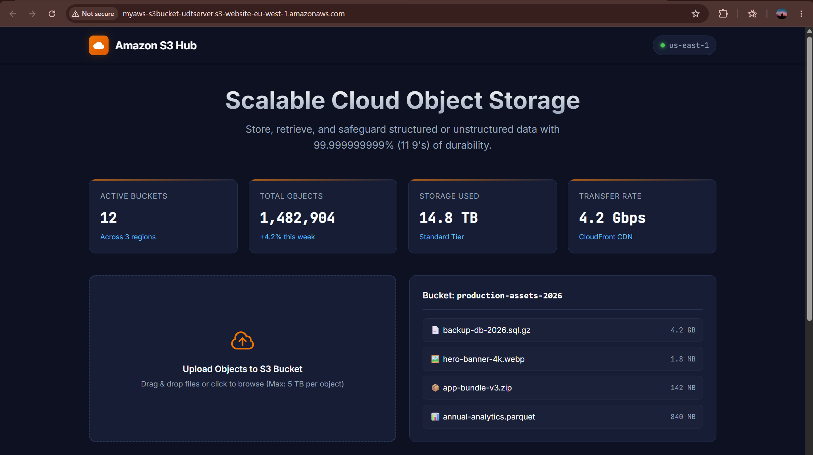
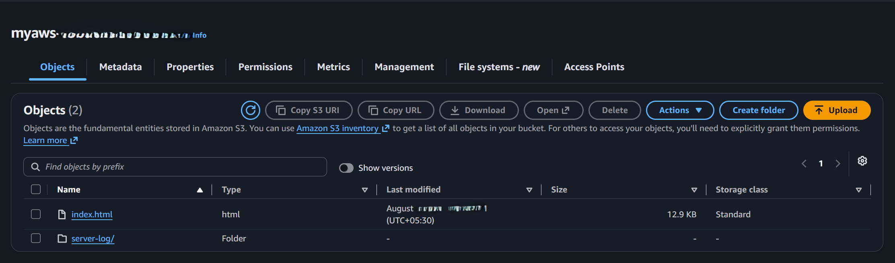

AWS S3 - Static Website Hosting Architecture

Project Overview

This project demonstrates how to host a serverless, highly scalable static web application using Amazon Simple Storage Service (Amazon S3).

The goal is to:

- Host a modern responsive web dashboard without provisioning backend servers.
- Configure public read access using S3 Bucket Policies.
- Enable static website hosting with index and custom routing.
- Deliver fast, low-latency web access globally using the native S3 website endpoint.

Services Used

- Amazon S3 (Simple Storage Service)
- AWS IAM & S3 Bucket Policy
- HTML5 & CSS3
- Web Browser

Bucket Details

| Parameter | Configuration |
|-----------|---------------|
| Bucket Name | myaws-s3bucket-udtserver |
| AWS Region | Europe (Ireland) eu-west-1 |
| Public Access | Enabled (Read-Only) |
| Index Document | index.html |
| Website Endpoint | http://myaws-s3bucket-udtserver.s3-website-eu-west-1.amazonaws.com |

Step 1 - Create S3 Bucket

Created a general-purpose S3 bucket with the specified name and region:

Bucket Name: myaws-s3bucket-udtserver
Region: Europe (Ireland) eu-west-1

Step 2 - Configure Public Access Settings

Unchecked Block all public access under the Permissions tab and confirmed the security acknowledgement.

Step 3 - Attach Bucket Policy

Added a JSON bucket policy to grant public GetObject read permissions to anyone visiting the site:

Step 4 - Enable Static Website Hosting

Enabled Static Website Hosting under the bucket Properties tab:

Hosting Type: Host a static website
Index Document: index.html

Step 5 - Upload Website Objects

Uploaded the static website source code (index.html) to the root directory of the bucket.

Testing & Verification

Verified the following:

    Verified that the S3 website endpoint resolves successfully across web browsers.

    Confirmed that the static assets and CSS styles load properly with zero 403 Forbidden errors.

    Confirmed that objects in the bucket are securely accessible via public read permissions.

Learning Outcomes

    Created and configured an Amazon S3 general-purpose bucket.

    Managed AWS S3 Block Public Access permissions.

    Wrote and attached a custom JSON Bucket Policy for read access.

    Enabled and verified native S3 Static Website Hosting.

    Deployed serverless frontend architecture on AWS.

Author

ADITYA MANIVANNAN

AWS Cloud | DevOps Engineer
